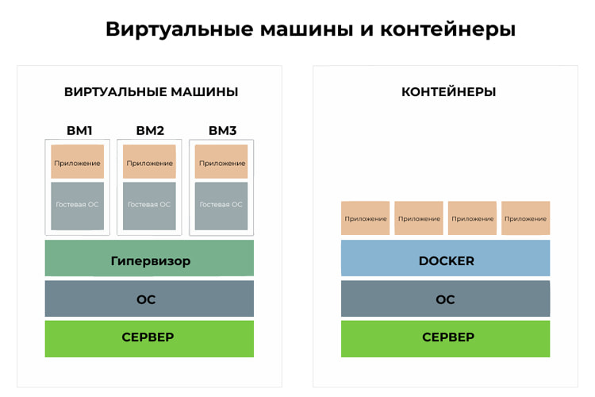

# 
 Маленький гайд на контейнеры

## 
 Intro 

Виртуальные машины и контейнеры - это способы упаковывать и запускать программы, чтобы они работали на компьютере или сервере.

Виртуальные машины - это как отдельные компьютеры внутри настоящего компьютера. У каждой виртуальной машины есть своя операционная система и ресурсы, такие как процессор и память. Это позволяет запускать разные операционные системы на одном компьютере, но требует больше ресурсов и может быть медленнее.

Контейнеры - это более легкий способ запускать программы. Они упаковывают программу и все, что ей нужно, вместе, создавая своеобразную "коробку" с программой внутри. Контейнеры используют общую операционную систему с основным компьютером, поэтому они работают быстрее и используют меньше ресурсов. Контейнеры также легко переносятся между компьютерами.

### Для наглядности

### И ещё для наглядности

|Характеристика	         |   Docker контейнеры    |  Виртуальные машины    |
|------------------------|------------------------|------------------------|
|Уровень изоляции	     |  Операционная система  | Аппаратное обеспечение |
|Ресурсоемкость          |	Меньше                |	Больше                 |
|Запуск и остановка      |	Быстрее               |	Медленнее              |
|Размер                  |	Меньше                |	Больше                 |
|Изоляция                |	Менее глубокая        |	Глубокая               |
|Нагрузка на хост-систему|	Меньше                |	Больше                 |
|Совместимость           |	Ограниченная          |	Высокая                |
|Виртуализация ОС        |	Да                    |	Да                     |
|Гипервизор              |	Не требуется          |	Требуется              |

\
\
И именно эти их преимущества понадобятся нам на этом курсе. 

Есть несколько популярных инструментов контейнеризации:

1. Docker

2. Podman

3. rkt

4. LXC/LXD

5. CRI-O

Самый "user-friendly" из них - Docker (хотя он и не самый эффективный)

## 
 Кто такие контейнер и образ

Простыми словами, контейнер - маленькая изолированная система, которая содержит все необходимое для запуска и работы приложения, включая код, среду выполнения и зависимости, а запускается она довольно быстро.

Образ контейнера - это своего рода шаблон или "заготовка", на основе которой создается и запускается контейнер. Он содержит все необходимые компоненты приложения, такие как код, библиотеки, файлы конфигурации и зависимости. Образ является статичным и неизменяемым - вы не можете изменять его в процессе его работы. Вместо этого, если вам нужны изменения, вы создаете новый контейнер на основе обновленного образа.

Образ контейнера можно сравнить с классом в объектно-ориентированном программировании. Класс определяет структуру и поведение объектов, но сам по себе он не является экземпляром объекта. Точно так же, образ контейнера определяет содержимое и настройки контейнера, но сам по себе он не является запущенным контейнером. Как только вы создаете экземпляр класса, вы получаете объект, с которым можно взаимодействовать. Аналогично, когда вы запускаете контейнер на основе образа, вы получаете работающий экземпляр контейнера, с которым можно взаимодействовать и который выполняет задачи, связанные с приложением.

## 
 Где искать образы, как их разворачивать и модифицировать

***команды в этом разделе будут выделены жирным курсивом***

Как у git есть GitHub, так и у docker есть DockerHub.
В первой лабораторной работе вам предложено работать с образом Alpine Linux. 

На [официальной странице](https://hub.docker.com/_/alpine/) видим **Supported tags and respective Dockerfile links**. Это различные версии образа, и как к ним обращаться из Dockerfile (про него чуть позднее). В рамках лабораторного курса нас почти всегда будет интересовать версия **latest**, но в ваших проектах следует использовать конкретные версии ~~так как случайно вышедший ОООЧЕНЬ КРУТОЙ НОВЫЙ ПАТЧ может случайно сломать вам всю систему~~.

Допустим вы установили себе Docker в том или ином виде. Чтобы запустить контейнер Alpine, необходимо выполнить  ***docker run alpine***.

- ***run*** - команда для запуска контейнера
- ***alpine*** - имя образа из которого собирать контейнер 

После этого docker попробует найти образ alpine:latest локально ( через двоеточие обозначается версия ), не найдёт, скачает его с DockerHub и разернёт. Правда сразу после этого контейнер завершит работу т.к. делать ему нечего ( это пустой контейнер с OS без исполняемого приложения ).

Но т.к. это контейнер с системой, давайте подключимся к этой системе.
Для этого необходимо выполнить ***docker run -it alpine***. 

***-i (или --interactive)*** - флаг позволяет взаимодействовать с контейнером через стандартный ввод (stdin). Он обеспечивает поток ввода в контейнер, что позволяет пользователю взаимодействовать с командной оболочкой или другими интерактивными приложениями внутри контейнера.

***-t (или --tty)*** - флаг создает псевдотерминал (pseudo-TTY) внутри контейнера. Он обеспечивает поддержку форматирования вывода и делает вывод более читабельным. Без этого флага вывод может быть нечитаемым или неформатированным.

После этого вы поднимите контейнер и подключитесь к нему в терминал.
Чтобы выйти, наберите ***exit***.

Про остальные флаги docker run можно почитать [ТУТ](https://docs.docker.com/engine/reference/commandline/run/).

#### 
 Теперь про Dockerfile

Далеко не всегда готовый образ удовлетворяет всем требования программиста, так что часто приходится их достраивать. Именно для этого и нужен Dockerfile.

Подробно про все команды можно почитать [ТУТ](https://docs.docker.com/engine/reference/builder/).

Dockerfile начинается с базового образа.
В нашем случае:
 - ***FROM alpine***

Затем часто необходимо установить необходивые пакеты, назначить рабочую директорию, скопировать какие-то файлы в контейнер и запустить необходимую программу:

- ___RUN apk update && apk add \*название пакета\*___
- ___WOKRDIR /\*имя директории\*___
- ___COPY \*src\* \*dist\*___
- ___CMD ["\*команда для запуска программы\*"]___

Какие-то шаги могут быть лишними, какие-то повторяющимися

Затем необходимо **собрать** образ. Для это используется команда ___build___:

В моём случае:  ___sudo docker build -t 1laba .___ <---- точка - это часть команды!
- ***-t*** - флаг тэга образа. По этому тэгу далее мы будем запускать контейнер.
- ***.*** - это путь до Dockerfile

Ну и наконец запустить по уже известной схеме:
- ***docker run 1laba***

# 
 Congratulations, вы готовы к первой лабе!

